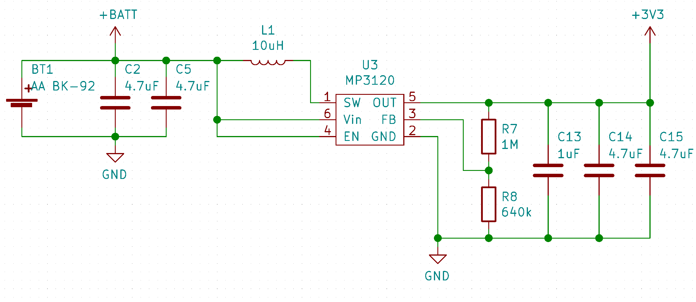
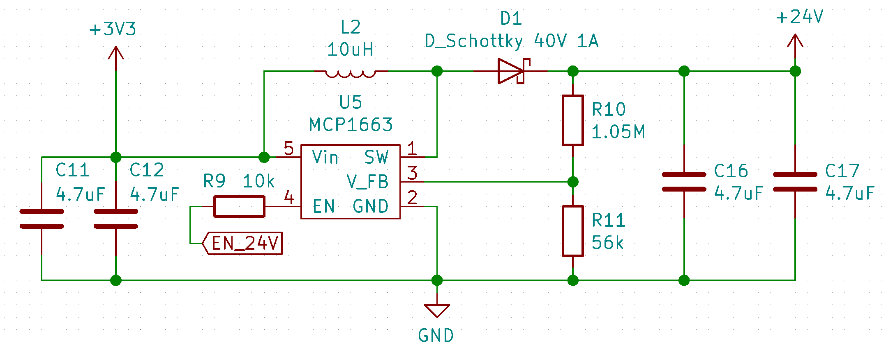

# VFD Watch Project

This project was originally inspired by Johngineer's [ChronodeVFD](https://blog.adafruit.com/2014/10/29/chronodevfd-a-watch-by-johngineer-wearablewednesday/) project. However no concrete design information were available therefore this project was born.

The goal was to create a mobile driver circuit for the common IVL2-5/7 vacuum fluorescent display, that is powered by a single cell battery. The datasheet of the display can be found on the [Loststreak](http://loststeak.com/ivl2-75-vfd-datasheets/) blog.

## Circuit elements

### Microcontroller
An **ESP32 WROOM-32** module is used as a microcontroller for the display and wireless communication. It is interfaced fo r programming via a **FT231XS** USB-Serial converter.

### Battery voltage regulation
The choice for the battery driver IC fell on the **MP3120** single cell 1.2A step up module as it can handle very low battery voltages and still start up. If wireless communication is used during the power up of the display the step-up module won't be able to supply enough power from a normal Alkaline cell to the ESP32 and a brownout reset will occur. Primary lithium cells, 2 Alkaline batteries or LiIon should be sufficient to power all functions at the same time.



### VFD driver
The display is driven by a 24V rail from a **MCP1663** step-up converter and high-side switches (**TBD62783A**) to power the segments. The filament is driven from the 3.3V rail and pulse-modulated from a motor H-bridge driver (**DRV8837C**) to achieve an equivalent to the 2.4V @ 60mA power conditions described in the datasheet. The H-bridge design allows an equal brightness of the characters without the use of a complex center-tapped AC circuit.



## Software

### Functions

```cpp
void begin(uint8_t dutyCycle, uint32_t freqMultiplex, uint32_t freqHeat)
```

* ```dutyCycle``` sets the PWM duty cycle of the heating filament. 0-255; typical 120.
* ```freqMultiplex``` sets the rate at which the characters are cycled though (1kHz -> 200Hz total refresh of the display). The timing is controlled in the background by an interrupt function that calls for an update of the currently displayed character. This process runs on core 0 of the ESP32, therefore during WiFi use the display can flicker a bit.
* ```freqHeat``` sets the frequency of the heating filament PWM. The value should be in the kHz range.

```cpp
void deactivate()
```
Turns of the heating filament and the 24V rail to preserve power.


```cpp
void activate()
```
Turns the display back on after a ```deactivate()```.


```cpp
void setHours(uint8_t hours)
```
Sets the first two digits. Range 0-99.


```cpp
void setMinutes(uint8_t minutes)
```
Sets the last two digits. Range 0-99.

```cpp
void setCharacter(char character, int pos)
```
Displays a char (```a-z; 0-9; '-'```) at position ```pos``` (```0-3```)

```cpp
void print(char* text)
```
Similar to ```setCharacter()``` but it displays the first 4 chars of the array.

```cpp
void setSegment(uint8_t segments, uint8_t pos);
```
Sets specific segments of a digit through the use of a byte mask (least to most significant bit). E.g. ```0b00101000``` would set segments ```d``` & ```f```. ```pos``` declares the digit to be changed (```0-3```).
